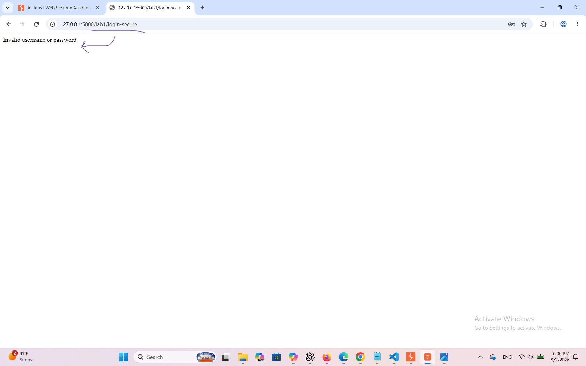
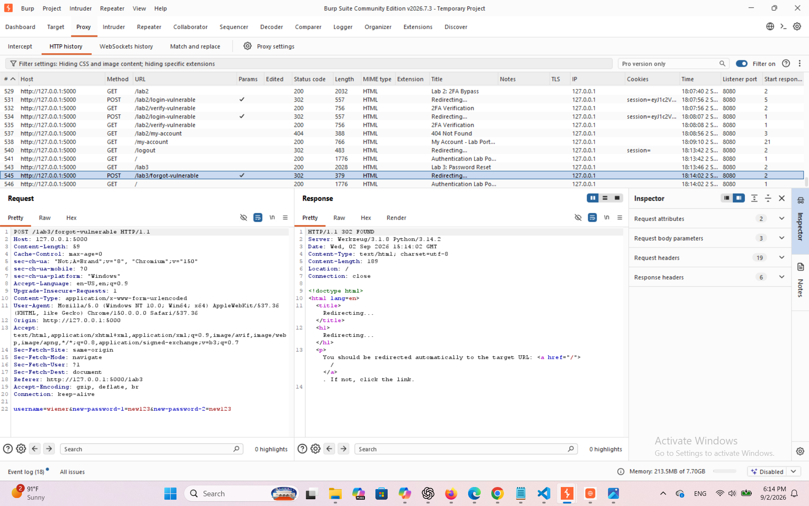
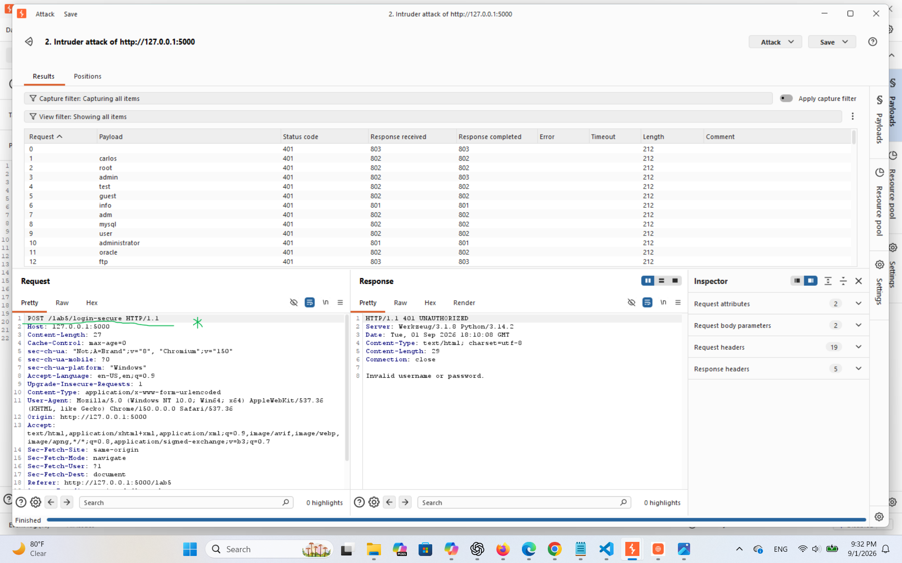
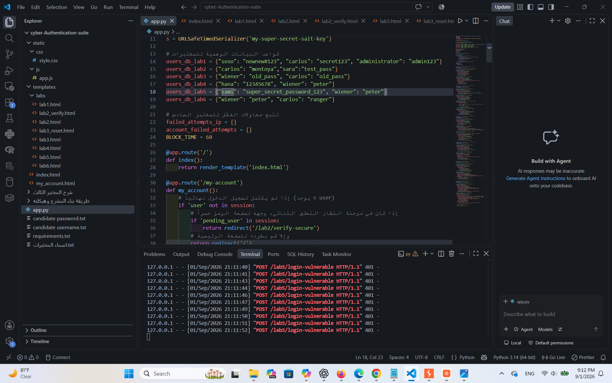

# 🛡️ Web Security Authentication Labs Portfolio

## PortSwigger Vulnerability Training Suite (Flask Implementation)

A comprehensive, professional local testing suite built with **Flask** to simulate, analyze, and mitigate critical authentication vulnerabilities based on the PortSwigger Web Security Academy labs. This project serves as an interactive educational portfolio demonstrating real-world web app security flaws and their robust cryptographic/architectural defenses.

---

## 📋 Table of Contents

1. [Overview & Project Architecture](#-overview--project-architecture)
2. [Tech Stack](#-tech-stack)
3. [Lab Breakdown, Analysis & Screenshots](#-lab-breakdown-analysis--screenshots)
   - [Lab 1: Username Enumeration via Different Responses](#lab-1-username-enumeration-via-different-responses)
   - [Lab 2: Two-Factor Authentication Bypass](#lab-2-two-factor-authentication-bypass)
   - [Lab 3: Password Reset Broken Logic](#lab-3-password-reset-broken-logic)
   - [Lab 4: Username Enumeration via Subtly Different Responses](#lab-4-username-enumeration-via-subtly-different-responses)
   - [Lab 5: Username Enumeration via Response Timing](#lab-5-username-enumeration-via-response-timing)
   - [Lab 6: Broken Brute-Force Protection, IP Block](#lab-6-broken-brute-force-protection-ip-block)
4. [Installation & Setup](#-installation--setup)
5. [License & Disclaimer](#-license--disclaimer)

---

## 🏗️ Overview & Project Architecture

This application simulates **6 major authentication vulnerabilities** divided into vulnerable endpoints and secure counterparts. It demonstrates how subtle logic flaws, improper error handling, side-channel timing disclosures, and broken rate-limiting allow attackers to compromise user accounts.

### Project File Structure

```text
security-labs-portfolio/
│
├── app.py                # Main Flask application containing all routes & logic
├── static/
│   └── css/
│       └── style.css     # Clean modern portfolio styling
└── templates/
    ├── index.html        # Main dashboard listing all 6 labs
    └── labs/             # Individual lab interfaces
```

---

## 🛠️ Tech Stack

- **Backend:** Python 3.x, Flask
- **Security Utilities:** `itsdangerous` (URLSafeTimedSerializer), `hmac` (constant-time comparison), `secrets`
- **Frontend:** HTML5, CSS3 (Responsive Portfolio Theme)

---

## 🔍 Lab Breakdown, Analysis & Screenshots

### Lab 1: Username Enumeration via Different Responses

- **Vulnerability:** The application returns distinct error messages (`"Invalid username"` vs `"Incorrect password"`), enabling an attacker to harvest valid usernames via automated wordlists.
- **Secure Defense:** Implement uniform generic error messages and artificial execution delays.
- **Lab Screenshots:**
  - `lab_1_sec` 
  - `lab_1_vlun (1)` .png>)
  - `lab_1_vlun (2)` .png>)
  - `lab_1_vlun (3)` .png>)
  - `lab_1_vlun (4)` .png>)
  - `lab_1_vlun (5)` .png>)

---

### Lab 2: Two-Factor Authentication Bypass

- **Vulnerability:** The vulnerable login route sets session state prematurely before 2FA verification.
- **Secure Defense:** Use staged session variables (`session['pending_user']`) requiring complete validation.
- **Lab Screenshots:**
  - `lab_2_vlun (1)` .png>)
  - `lab_2_vlun (2)` .png>)
  - `lab_2_vlun (3)` .png>)

---

### Lab 3: Password Reset Broken Logic

- **Vulnerability:** The reset endpoint trusts user parameters without cryptographic verification tokens.
- **Secure Defense:** Implement signed, time-limited tokens via `itsdangerous`.
- **Lab Screenshots:**
  - `lab_3_sec (1)` .png>)
  - `lab_3_sec (2)` .png>)
  - `lab_3_sec (3)` .png>)
  - `lab_3_vlun` 

---

### Lab 4: Username Enumeration via Subtly Different Responses

- **Vulnerability:** Subtle variations in status codes or phrasing leak account existence.
- **Secure Defense:** Return standardized HTTP status codes and responses.
- **Lab Screenshots:**
  - `lab_4_sec (1)` .png>)
  - `lab_4_sec (2)` .png>)
  - `lab_4_sec (3)` .png>)
  - `lab_4_sec (4)` .png>)
  - `lab_4_vlun (1)` .png>)
  - `lab_4_vlun (2)` .png>)
  - `lab_4_vlun (3)` .png>)
  - `lab_4_vlun (4)` .png>)

---

### Lab 5: Username Enumeration via Response Timing

- **Vulnerability:** Processing duration differs between existing and non-existing accounts.
- **Secure Defense:** Enforce constant-time comparisons and uniform time delays.
- **Lab Screenshots:**
  - `lab_5_secure` 
  - `lab_5_vlun (1)` .png>)
  - `lab_5_vlun (2)` .png>)
  - `lab_5` 

---

### Lab 6: Broken Brute-Force Protection, IP Block

- **Vulnerability:** Rate-limiting relying solely on client IP headers that can be spoofed.
- **Secure Defense:** Implement account-level locking and time-based lockouts.
- **Lab Screenshots:**
  - `lab_6_vlun (1)` .png>)
  - `lab_6_vlun (2)` .png>)
  - `lab_6_vlun (3)` .png>)
  - `lab_6_vlun (4)` .png>)

---


---

## ⚖️ License & Disclaimer

Created strictly for educational purposes and authorized security practice.
